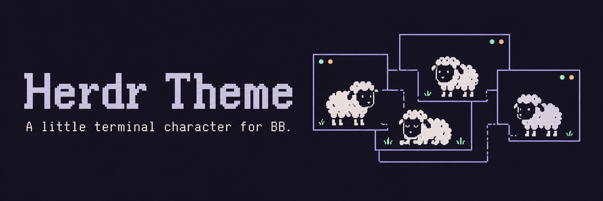
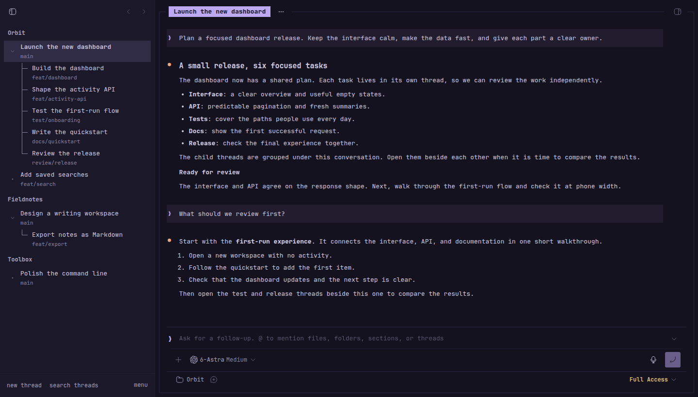
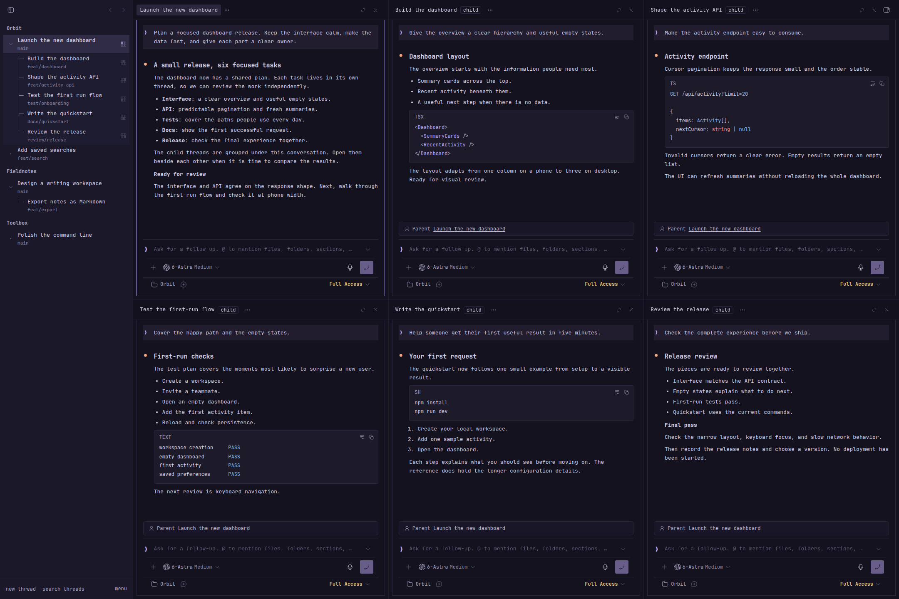
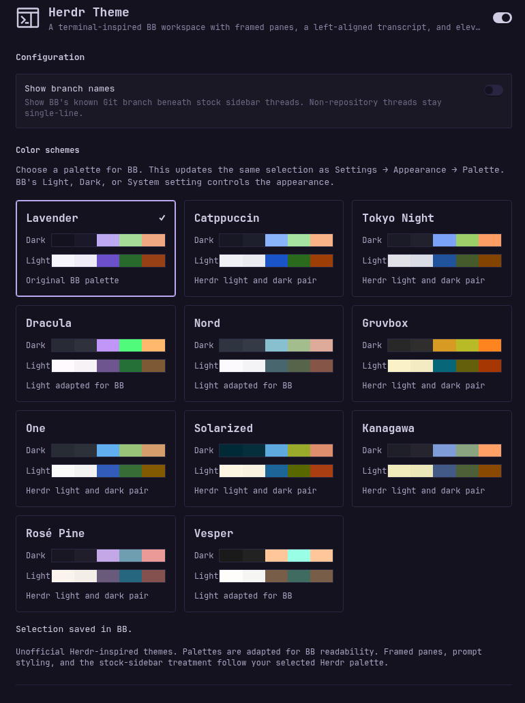

# Herdr Theme

Bring a little terminal character to BB. Herdr Theme pairs eleven color families
with framed conversations, compact prompts, and a thread tree that looks at home
in a terminal.

Inspired by [Herdr](https://herdr.dev/). Built for BB's threads and subthreads.
An independent, unofficial community project.

[Build checks](https://github.com/davideiffert/bb-plugin-herdr-theme/actions/workflows/check.yml) · [Changelog](CHANGELOG.md) · [Contributing](CONTRIBUTING.md) · [MIT license](LICENSE)

## A familiar thread, a different feel

<picture>
  <source media="(prefers-color-scheme: dark)" srcset="assets/screenshots/conversation-dark.png">
  <source media="(prefers-color-scheme: light)" srcset="assets/screenshots/conversation-light.png">
  
</picture>

*Lavender, with optional branch names enabled. [Dark view](assets/screenshots/conversation-dark.png) · [Light view](assets/screenshots/conversation-light.png).*

## What changes

- **A terminal-style conversation.** Thin pane frames, highlighted titles, full-width transcripts, and a flat prompt.
- **A readable thread tree.** Connected child-thread branches, clear selection, and colored native activity indicators.
- **Details when you want them.** Optional Git branch names beneath project-thread titles, including `main`.
- **Eleven palette families.** Light and dark appearances, coordinated code highlighting, and a swatch picker in settings.
- **Local typography.** JetBrains Mono is bundled. No font service or network request required.

BB still owns the editor, attachments, voice controls, menus, keyboard shortcuts,
and thread navigation. This theme does not change agent behavior or add workspace
management.

## Room for the whole task



*One plan and five child threads, arranged with BB's native split controls.
Herdr Theme styles the panes; BB provides the layout and navigation.
[Open the full-size screenshot](assets/screenshots/six-panes-dark.png).*

These are captures of BB 0.43 running the theme in an isolated demo workspace.
Projects, branches, and conversations are scripted sample content, with a saved
model catalog for the demo controls. No private conversations or live agent runs
are shown.

## Install the preview

Requires BB 0.43 or newer. The public repository is available; the first tagged
release is still being prepared. This command installs the current preview:

```sh
bb plugin install git:https://github.com/davideiffert/bb-plugin-herdr-theme@main
```

Open **Settings → Herdr Theme → Color schemes** to choose a palette. Use BB's
Appearance settings for Light, Dark, or System. Select another theme to return
to its appearance; Herdr's extra styling turns off automatically.

## Find your colors

Lavender, Catppuccin, Tokyo Night, Dracula, Nord, Gruvbox, One, Solarized,
Kanagawa, Rosé Pine, and Vesper.

Lavender is original to this theme. The other ten families adapt Herdr's palette
values for BB. Dracula, Nord, and Vesper include original BB light companions,
clearly labeled in the picker.

<picture>
  <source media="(prefers-color-scheme: dark)" srcset="assets/screenshots/palettes-dark.png">
  <source media="(prefers-color-scheme: light)" srcset="assets/screenshots/palettes-light.png">
  
</picture>

*The palette picker in BB. Captured in a clean test instance.*

## Optional branch names

Turn on **Show branch names** in **Settings → Herdr Theme → Configuration**.
It is off by default. Threads with a branch known to BB get a second line;
threads without one stay single-line. Pinned rows and replacement sidebars do
not display these branch annotations.

## Compatibility

Tested on BB 0.43. Composition relies on existing BB interface hooks, which are
not a versioned styling API. New BB versions may require adjustments.

- Folders keeps its own thread list.
- Compact Navigation and Herdr use the same navigation slot. Only one supplies the navigation at a time.
- Mobile web retains BB's native sidebar and touch controls. The iPhone editor has been user-tested; automated phone checks use browser emulation. Actual microphone recording has not been independently verified.
- Workspace tabs and saved split arrangements are outside this theme's scope.

See [release checks](docs/RELEASE_CHECKS.md) for the current verification limits.

## Contribute

Found a problem? [Open an issue](https://github.com/davideiffert/bb-plugin-herdr-theme/issues)
with your BB version, palette, device, and reproduction steps. Focused pull
requests are welcome. See [CONTRIBUTING.md](CONTRIBUTING.md) to get started.

```sh
npm ci
npm run check
npm run build
```

The committed `font.css` is intentional. BB's Git installer builds the plugin
directly without running npm lifecycle scripts. The build command regenerates
it from the bundled WOFF2. This project is currently distributed through Git,
not npm.

## Credits and licenses

Created with David Eiffert, with palette and composition work by Fable 5.1 and
integration by Codex. Banner illustration generated with OpenAI's image tool.

Herdr Theme is not affiliated with Herdr, BB, or Catppuccin. Plugin code is
[MIT licensed](LICENSE).

[JetBrains Mono](https://github.com/JetBrains/JetBrainsMono) is bundled under the
[SIL Open Font License](assets/OFL.txt). `Herdr Mono` is its local CSS alias,
not a modified font. The regular variable face supports weights 100 through
800; italics use browser synthesis.

Imported palettes retain Herdr's [Apache 2.0 license](palettes/LICENSE-herdr.txt).
See [palette provenance](palettes/README.md) for the source revision and
adaptations, including the [Catppuccin](https://github.com/catppuccin/catppuccin)
family.
