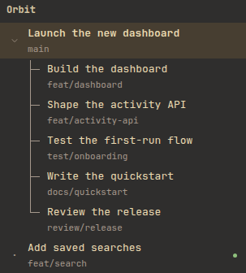

# Herdr Theme

Give BB a little terminal character. Herdr Theme frames conversations like
terminal panes, keeps the prompt compact, and connects child threads with tree
branches. Choose from eleven color families, each with light and dark versions.

Inspired by [Herdr](https://herdr.dev/) and built for BB's threads and subthreads.
Independent and unofficial.

[Build checks](https://github.com/davideiffert/bb-plugin-herdr-theme/actions/workflows/check.yml) · [Changelog](CHANGELOG.md) · [Contributing](CONTRIBUTING.md) · [MIT license](LICENSE)

## A familiar thread, a different feel

<picture>
  <source media="(prefers-color-scheme: dark)" srcset="assets/screenshots/conversation-dark.png">
  <source media="(prefers-color-scheme: light)" srcset="assets/screenshots/conversation-light.png">
  
</picture>

*Branch names turned on. [Lavender dark](assets/screenshots/conversation-dark.png) · [Catppuccin Latte light](assets/screenshots/conversation-light.png). The image follows your light or dark appearance.*

## What changes

- **A terminal-style conversation.** Thin pane frames, highlighted titles, full-width transcripts, and a flat prompt.
- **A readable thread tree.** Connected child-thread branches, clear selection, and colored activity indicators.
- **Details when you want them.** Optional Git branch names beneath project-thread titles, including `main`.
- **Eleven palette families.** Light and dark appearances, coordinated code highlighting, and a swatch picker in settings.
- **A bundled font.** JetBrains Mono is bundled. No font service or network request required.

BB still owns the editor, attachments, voice controls, menus, keyboard shortcuts,
and thread navigation. This theme does not change agent behavior or add workspace
management.

## Room for the whole task


*Tokyo Night. One plan and five child threads, arranged with BB's native split controls.
[Open the full-size screenshot](assets/screenshots/six-panes-dark.png).*

Screenshots show BB 0.43 with sample projects and conversations written for the
demo. They do not show private conversations or live agent runs.

## Install the preview

Requires BB 0.43 or newer. There is no tagged release yet, so this installs the
preview from the main branch:

```sh
bb plugin install git:https://github.com/davideiffert/bb-plugin-herdr-theme@main
```

Open **Settings → Herdr Theme → Color schemes** to choose a palette. Use BB's
Appearance settings for Light, Dark, or System. Pick any other theme and Herdr's
extra styling turns off.

## Find your colors

Lavender, Catppuccin, Tokyo Night, Dracula, Nord, Gruvbox, One, Solarized,
Kanagawa, Rosé Pine, and Vesper.

Lavender is original to this theme. The other ten families adapt Herdr's palette
values for BB. Herdr's Dracula, Nord, and Vesper are dark-only, so this theme adds
its own light versions. The picker labels them.

<picture>
  <source media="(prefers-color-scheme: dark)" srcset="assets/screenshots/palettes-dark.png">
  <source media="(prefers-color-scheme: light)" srcset="assets/screenshots/palettes-light.png">
  
</picture>

*The palette picker in BB's settings.*

## Optional branch names

Turn on **Show branch names** in **Settings → Herdr Theme → Configuration**.
It is off by default. When BB knows a thread's Git branch, its name appears under
the thread title. Threads without a branch stay on one line. Pinned threads and
sidebars supplied by other plugins do not show these branch names.



*Gruvbox dark, with branch names turned on.*

## Compatibility

Tested on BB 0.43. The theme styles parts of BB's current interface that can
change between releases. A new BB version may need a theme update.

- The Folders plugin keeps its own thread list.
- Compact Navigation and Herdr use the same navigation slot. Only one supplies the navigation at a time.
- On phones, BB's sidebar and touch controls stay in place. The editor has been tried on an iPhone. Other phone checks used browser emulation. Microphone recording remains untested.
- Workspace tabs and saved split arrangements are outside this theme's scope.

See [release checks](docs/RELEASE_CHECKS.md) for what was and was not tested.

## Contribute

Found a problem? [Open an issue](https://github.com/davideiffert/bb-plugin-herdr-theme/issues)
with your BB version, palette, device, and reproduction steps. Focused pull
requests are welcome. See [CONTRIBUTING.md](CONTRIBUTING.md) to get started.

To build locally:

```sh
npm ci
npm run check
npm run build
```

The committed `font.css` is intentional. BB's Git installer builds the plugin
directly without running npm lifecycle scripts. The build command regenerates
it from the bundled WOFF2. This project is currently distributed through Git,
not npm.

## Credits and licenses

Made by David Eiffert, with palette and layout work by Claude Fable 5.1 and
integration by Codex. Banner illustration generated with OpenAI's image tool.

Herdr Theme is not affiliated with Herdr, BB, or Catppuccin. Plugin code is
[MIT licensed](LICENSE).

[JetBrains Mono](https://github.com/JetBrains/JetBrainsMono) is bundled under the
[SIL Open Font License](assets/OFL.txt). `Herdr Mono` is its local CSS alias,
not a modified font. The bundled variable face supports weights 100 through
800. There is no italic face, so browsers synthesize italics.

Imported palettes retain Herdr's [Apache 2.0 license](palettes/LICENSE-herdr.txt).
See [palette provenance](palettes/README.md) for the source revision and
adaptations, including the [Catppuccin](https://github.com/catppuccin/catppuccin)
family.
